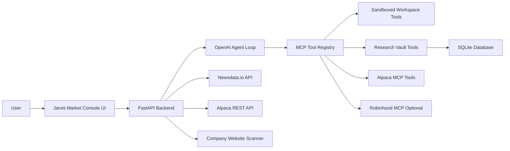
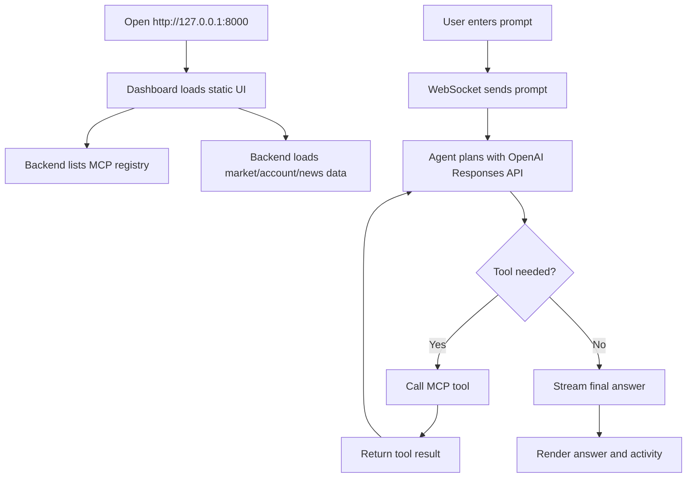
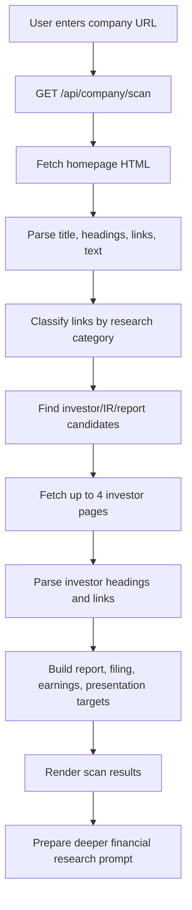

# Product Design Document: Jarvis Market Console

## 1. Product Summary

Jarvis Market Console is a local AI-powered market research, coding, and trading-assistant dashboard. It combines a web dashboard, a FastAPI backend, a ChatGPT agent, MCP tools, Alpaca market data, Newsdata.io headlines, local research notes, company website scanning, and paper-safe trading controls.

The product is designed to help a user research markets, scan companies, monitor news, ask an AI agent to write or test code, and prepare investment workflows from one screen.

This document describes what the product does, who it is for, why each feature exists, and how users move through the system.

## 2. Product Goals

- Give the user a single command center for coding, market research, news, watchlists, and agent actions.
- Let the agent use MCP tools for file access, Python execution, company scanning, local research memory, and market data.
- Keep live trading locked by default and make paper trading the normal operating mode.
- Show account funds, market pulse, market movers, news sentiment, ticker-linked news, and video feeds in one dense dashboard.
- Support long-term research by scanning company websites, investor pages, filings, earnings, and presentations.
- Store structured user research locally in a Research Vault so future prompts can reuse prior thesis, risk, and news notes.

## 3. Target Users

Primary user:

- Individual trader, investor, builder, or student who wants a personal AI command center.

Secondary user:

- Developer who wants a reference implementation for OpenAI Responses API + MCP + FastAPI + local dashboard.

## 4. Key User Problems

- Market research is scattered across websites, brokerage tools, notes, news, and filings.
- AI agents are useful but need safe access to tools and local context.
- Trading automation can be risky if order tools are exposed too early.
- Company research needs more than a homepage summary; investor reports, SEC filings, and earnings links matter.
- Coding agents need a sandbox to write files and run tests without touching unrelated local files.

## 5. Product Principles

- One-screen density: show more useful data without forcing the user through many pages.
- Paper-safe first: paper trading and research are default; live trading requires explicit environment unlocks.
- Tool transparency: stream tool calls and results so the user sees what the agent is doing.
- Local ownership: research notes and workspace files live on the user's machine.
- Expandable MCP design: new MCP servers can be added through configuration instead of rewriting the app.

## 6. Product Context Diagram

## 7. Main Product Areas

### 7.1 Dashboard Header

The main dashboard title is `Jarvis Market Console`. The status pill shows whether the WebSocket agent connection is idle, connected, thinking, done, or errored.

### 7.2 Left Sidebar

The left sidebar contains:

- Model name from the active agent registry.
- MCP server count.
- MCP tool count.
- Trading mode, such as paper-safe.
- Account currency.
- Watch ticker controls.

The watchlist lets the user add custom tickers and quickly prepare news or options prompts for those tickers.

### 7.3 Market Pulse

Market Pulse groups broad market snapshots into categories:

- PRE-MKT
- ASIA
- EUR
- BONDS
- OIL
- GOLD
- FX
- CRYPTO
- US

The backend uses Alpaca snapshots when configured and returns structured market rows with price, change, percent change, trend, and reference links.

### 7.4 Market Movers

The Market Movers board shows:

- Top movers.
- Bottom movers.
- Most active names.
- Unusual volume names.

The goal is to help the user quickly identify where attention is concentrated.

### 7.5 Agent Chat Feed

The main feed lets the user send prompts to the AI agent. The agent can:

- Write files in the sandbox.
- Read files in the sandbox.
- List files.
- Run Python tests.
- Scan company websites.
- Search or summarize Research Vault notes.
- Use configured market-data MCP tools.

Tool calls and tool results stream back to the UI.

### 7.5.1 Trade Action Center

The Trade Action Center sits under the market/risk cockpit. It captures the latest agent research result and exposes three direct actions:

- `Trade Ticket`: turn the latest result into an execution-ready trade ticket without placing an order.
- `Execute Paper`: use the latest result to execute at most one small paper trade if paper order tools are available and the setup passes risk checks.
- `Start Scout` / `Stop Scout`: run a continuous paper scout every five minutes to scan configured markets and watchlist names for the best risk-adjusted setup.

The Portfolio Metrics strip records tracked trades, win rate, win/loss count, reward/risk ratio, and exposure ratio under the funds cards. The Trade Board records recent tickets and execution requests below those metrics. It shows symbol, status, entry, exit/target, stop, size, and last update time in a scrollable table.

The `Clear Chat` button stays beside the command `Run` button so the user can reset the chat feed without scrolling. The Calendar tab groups saved trade records by day and shows total trades, wins, losses, skipped records, blocked records, and symbols for each day.

The Risk Management strip lets the user adjust order notional, max position size, daily loss limit, and options contract count without editing `.env`. Saved dashboard overrides update the visible Risk line and are included in future trade-ticket and paper-execution prompts.

The continuous scout is designed for paper automation. If the system is in live mode, it returns a trade ticket instead of silently placing live orders.

### 7.6 Tools Panel

The Tools tab shows the MCP tools available to the agent. This helps the user confirm whether workspace, Alpaca, Newsdata, Robinhood, or Research Vault tools are connected.

### 7.7 Activity Panel

The Activity tab shows live events such as:

- Registry loaded.
- Agent planning.
- Tool call started.
- Tool result returned.
- Warning or connection status.

### 7.8 News Panel

The News tab shows:

- News Factor Screen.
- Alpaca News Impact.
- Newsdata.io Feed.

The News Factor Screen groups headlines by themes:

- Breaking headlines.
- Earnings and guidance.
- Market movers.
- Macro calendar.
- Crypto catalysts.
- Corporate actions.

Each headline receives a simple sentiment classification from keyword scoring:

- Positive.
- Neutral.
- Negative.

Alpaca news also shows tickers affected by each article.

### 7.9 Research Panel

The Research tab includes:

- Company Website Scan.
- Options Research.
- Automation Prompts.

The Company Website Scan accepts a public company URL. It extracts:

- Page title.
- Description.
- Headings.
- Investor-relations pages.
- Investor headings.
- Financial reports.
- SEC filings.
- Earnings links.
- Presentations.
- Product, pricing, customers, partners, careers, news, security, about, and contact links.

The result includes `Deep Research` actions and a `Try Deeper Research` button that prepares a long-form investment research prompt.

### 7.10 Research Vault

Research Vault stores structured notes in SQLite. The user can save:

- Title.
- Tickers.
- Note type.
- Sentiment.
- Conviction.
- Horizon.
- Source URL.
- Tags.
- Body text.

The user can search notes, summarize a ticker, and ask the agent to use the saved research.

### 7.11 Live News Video

The Video tab embeds configured video feeds. YouTube watch URLs are converted into embed URLs by the backend.

## 8. User Flow Diagram

## 9. Company Research Flow

## 10. Functional Requirements

| ID | Requirement | Current Implementation |
| --- | --- | --- |
| PDD-FR-001 | Serve the dashboard locally | FastAPI serves `static/index.html` at `/` |
| PDD-FR-002 | Stream agent events live | WebSocket endpoint `/ws/agent` |
| PDD-FR-003 | Connect to MCP servers | `OpenAIMCPAgent.connect()` reads `mcp_config.json` |
| PDD-FR-004 | Provide sandbox coding tools | `mcp_server_example.py` exposes file and Python tools |
| PDD-FR-005 | Show market/account data | FastAPI Alpaca endpoints call Alpaca REST APIs |
| PDD-FR-006 | Show Newsdata.io headlines | `/api/newsdata/latest` |
| PDD-FR-007 | Add news sentiment | `analyze_news_sentiment()` |
| PDD-FR-008 | Store research notes | `research_vault.py` SQLite database |
| PDD-FR-009 | Scan company websites | `website_scan.py` |
| PDD-FR-010 | Keep live trading locked | Agent filters risky tool names unless unlock flags are set |
| PDD-FR-011 | Provide trade action buttons | Trade Action Center turns research results into tickets, paper orders, or continuous paper scout cycles |

## 11. Non-Functional Requirements

| Area | Requirement |
| --- | --- |
| Safety | Paper trading by default; live tools require explicit env confirmation |
| Privacy | Local research database and sandbox workspace stay on the user's machine |
| Reliability | API errors are converted to user-facing messages where possible |
| Extensibility | New MCP servers can be added in `mcp_config.json` |
| Observability | Activity feed and chat feed show tool calls, results, and warnings |
| Responsiveness | One-screen dashboard uses compact panels and tabs |

## 12. Safety and Risk Design

Trading safety is a product feature, not only a backend detail.

The app keeps risky order-changing tools locked unless the user intentionally configures live trading:

- `ALPACA_PAPER_TRADE=false`
- `LIVE_TRADING_ENABLED=true`
- `LIVE_TRADING_CONFIRMATION=I_UNDERSTAND_LIVE_TRADING_RISK`

Robinhood trading tools require a separate confirmation:

- `ROBINHOOD_TRADING_ENABLED=true`
- `ROBINHOOD_TRADING_CONFIRMATION=I_UNDERSTAND_ROBINHOOD_AGENTIC_TRADING_RISK`

The UI and prompts repeatedly say not to place orders unless the user explicitly asks and the backend has exposed the tools.

## 13. Success Metrics

- User can load the dashboard from `http://127.0.0.1:8000`.
- Agent registry shows connected MCP servers and tools.
- User can ask the agent to create and test code in the sandbox.
- User can scan a company website and see investor/financial-report links.
- User can save and search Research Vault notes.
- User can see market snapshots, movers, account funds, and news headlines.
- No live order tools are exposed unless intentionally unlocked.

## 14. Future Product Ideas

- Add PDF ingestion for annual reports and 10-K filings.
- Add scheduled scans for watchlist tickers.
- Add alert rules for news sentiment and unusual volume.
- Add portfolio exposure charts.
- Add deeper valuation templates for long-term investing.
- Add a safer live-trade approval modal with order preview and explicit confirmation.
- Add export to PDF or DOCX for research reports.
