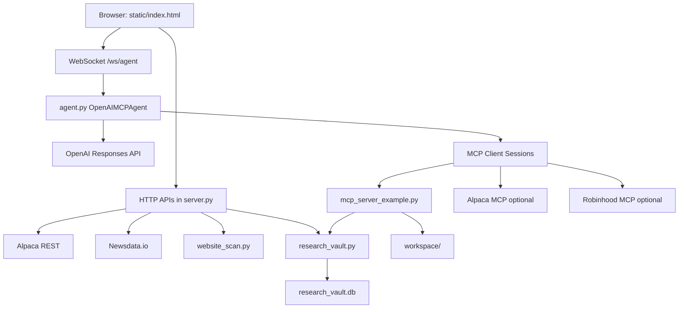
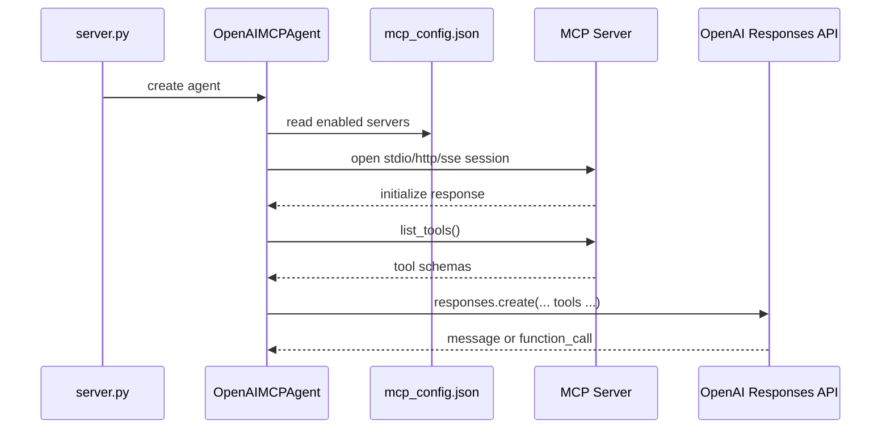
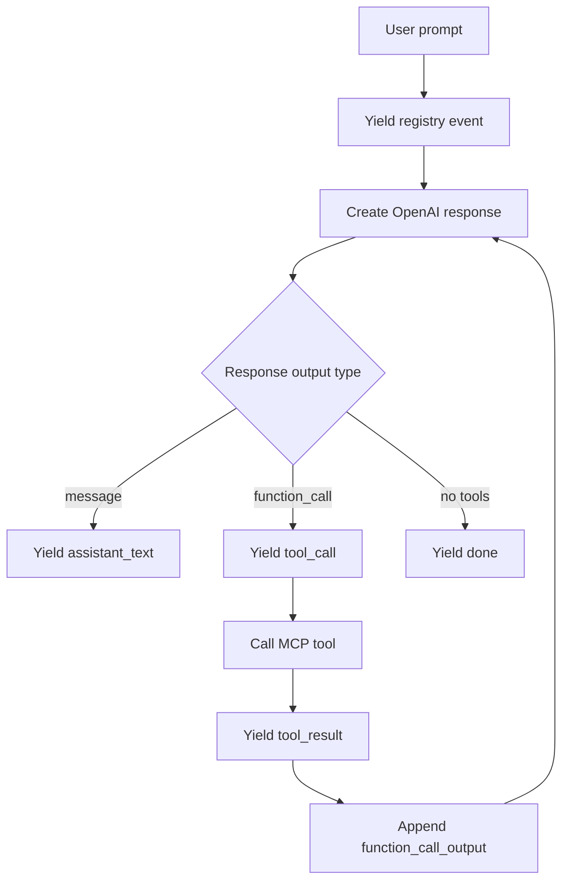
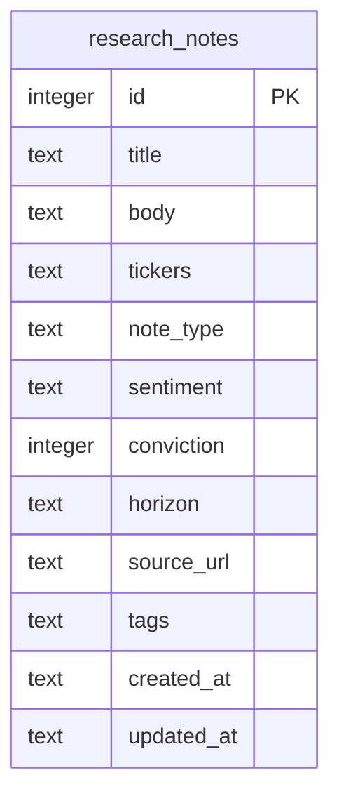
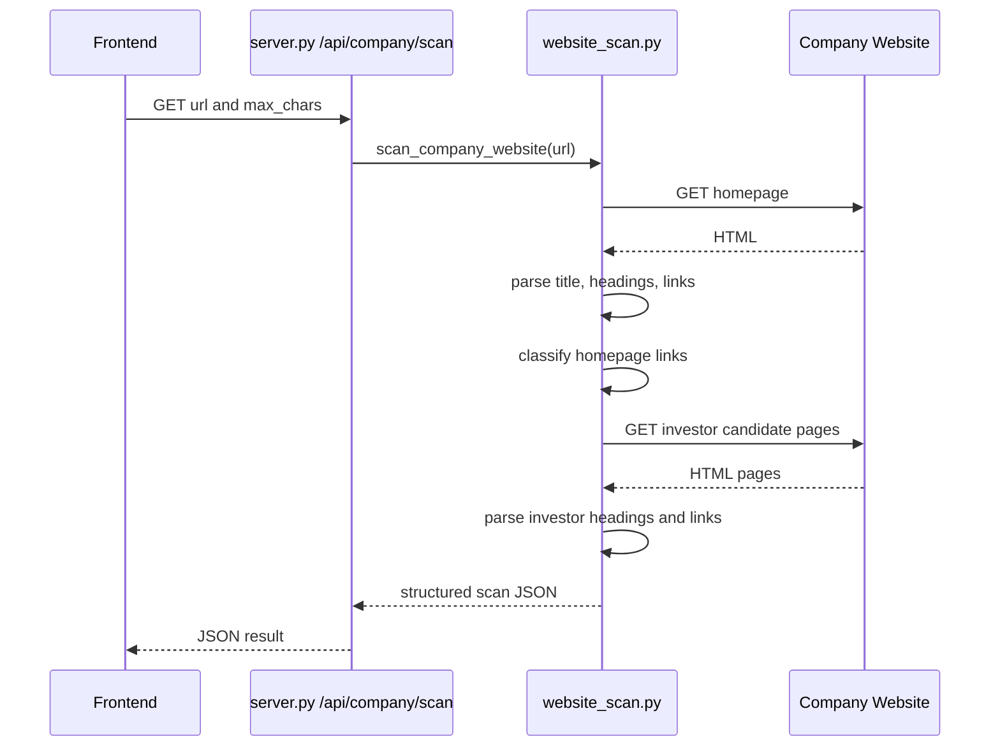
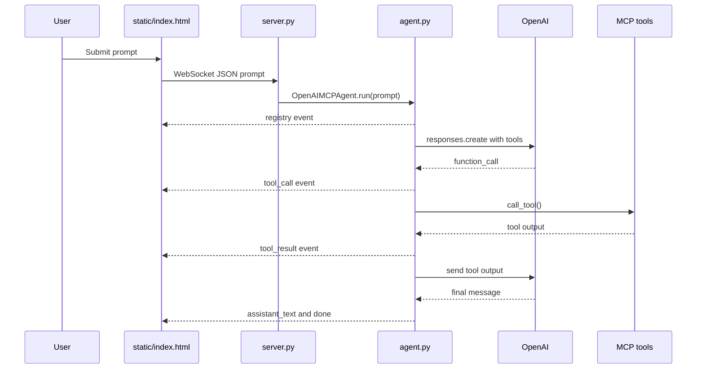

# Software Design Document: Jarvis Market Console

## 1. Purpose

This Software Design Document explains the code architecture of Jarvis Market Console. It describes the modules, runtime flow, API endpoints, MCP integration, data storage, safety controls, and frontend behavior.

The system is a local FastAPI web app with a static HTML dashboard and an OpenAI-powered agent that can call MCP tools.

## 2. Repository Structure

```text
DashBoard_Agent/
  agent.py
  server.py
  mcp_server_example.py
  website_scan.py
  research_vault.py
  static/
    index.html
  docs/
    PDD.md
    SDD.md
  mcp_config.example.json
  mcp_config.json
  requirements.txt
  README.md
  workspace/
  research_vault.db
```

Important ignored local files:

- `.env`: secrets and runtime configuration.
- `mcp_config.json`: local MCP configuration.
- `research_vault.db`: local SQLite research database.
- `workspace/`: sandboxed coding workspace.

## 3. High-Level Architecture



## 4. Runtime Components

| Component | File | Responsibility |
| --- | --- | --- |
| FastAPI backend | `server.py` | Serves UI, REST APIs, WebSocket agent stream |
| Agent orchestrator | `agent.py` | Connects MCP servers, registers tools, calls OpenAI, runs tool loop |
| Workspace MCP server | `mcp_server_example.py` | Sandboxed coding tools plus research/scanner tools |
| Newsdata MCP server | `newsdata_mcp_server.py` | Local sanitized wrapper for Newsdata.io latest, market, and crypto headlines |
| Research Vault | `research_vault.py` | SQLite schema and note CRUD/search/summarization |
| Website Scanner | `website_scan.py` | HTML parser and company/investor link classifier |
| Frontend dashboard | `static/index.html` | UI layout, panels, fetch calls, WebSocket rendering |

## 5. Backend Design: `server.py`

`server.py` creates the FastAPI app and mounts the static frontend.

```python
app = FastAPI(title="Jarvis Market Console")
app.mount("/static", StaticFiles(directory="static"), name="static")
```

The root route returns the dashboard:

```python
@app.get("/")
async def index() -> FileResponse:
    return FileResponse("static/index.html")
```

### 5.1 Backend API Endpoint Map

| Endpoint | Method | Purpose |
| --- | --- | --- |
| `/` | GET | Serve dashboard HTML |
| `/health` | GET | Basic server health and model |
| `/api/trading/config` | GET | Return trading mode, risk limits, market universe, video feeds |
| `/api/risk/settings` | POST | Save local dashboard risk overrides |
| `/api/trading/prompts` | GET | Return preset automation prompts |
| `/api/mcp/registry` | GET | Connect agent temporarily and list MCP servers/tools |
| `/api/alpaca/account` | GET | Return account funds from Alpaca |
| `/api/markets/overview` | GET | Return market pulse groups |
| `/api/markets/movers` | GET | Return top/bottom/active/unusual movers |
| `/api/watchlist/snapshots` | GET | Return watchlist price snapshots |
| `/api/alpaca/news` | GET | Return Alpaca ticker-linked news |
| `/api/research/notes` | POST | Add Research Vault note |
| `/api/research/notes` | GET | Search Research Vault notes |
| `/api/research/summary` | GET | Summarize Research Vault notes by ticker |
| `/api/research/notes/{note_id}` | DELETE | Delete a Research Vault note |
| `/api/company/scan` | GET | Scan company website/investor pages |
| `/api/newsdata/latest` | GET | Return Newsdata.io latest headlines |
| `/ws/agent` | WebSocket | Stream agent events |

### 5.2 Error Handling

`user_facing_error()` converts common OpenAI errors into clearer UI messages:

- `insufficient_quota`
- `invalid_api_key`
- `model_not_found`

This is why quota errors are shown as actionable text instead of raw stack traces.

### 5.3 News Sentiment

`analyze_news_sentiment()` uses keyword scoring. It reads article title/body/source text and assigns:

- `sentiment_label`
- `sentiment_score`
- `sentiment_confidence`
- `sentiment_reason`

This is lightweight sentiment, not a financial prediction model. It is designed for screening and attention routing.

### 5.4 Market Data

Market Pulse and Watchlist data are based on Alpaca REST snapshots when Alpaca keys are configured. Symbols are organized into groups such as US, crypto, FX, bonds, oil, gold, and regional ETFs.

### 5.5 Video Feed

`embed_video_url()` converts supported YouTube URLs:

- `youtube.com/watch?v=...`
- `youtube.com/embed/...`
- `youtube.com/live/...`
- `youtu.be/...`

into iframe-friendly embed URLs.

### 5.6 Risk Settings

`trading_status()` returns risk limits from `current_risk_settings()`. Environment values remain the defaults, and saved dashboard overrides are read from `risk_settings.json` or the path set by `RISK_SETTINGS_PATH`.

`POST /api/risk/settings` accepts `max_order_notional_usd`, `max_position_usd`, `max_daily_loss_usd`, and `options_max_contracts`. The backend clamps each value to configured min/max bounds, writes the normalized settings to `risk_settings.json`, and returns `risk_source=dashboard` so the UI can show that local overrides are active.

## 6. Agent Design: `agent.py`

`agent.py` contains the `OpenAIMCPAgent` class.

The agent responsibilities are:

1. Load `.env`.
2. Load `mcp_config.json`.
3. Connect to enabled MCP servers.
4. List tools from each MCP server.
5. Convert MCP tools into OpenAI function tools.
6. Send user prompts to the OpenAI Responses API.
7. Stream assistant text, tool calls, tool results, warnings, and done events.

### 6.1 MCP Connection Flow



### 6.2 Supported MCP Transports

The agent supports:

- `stdio` for local servers such as `mcp_server_example.py`.
- `streamable_http` or `http` for remote MCP servers.
- `sse` for server-sent-event MCP servers.

### 6.3 Tool Name Mapping

MCP tools are renamed before being sent to OpenAI:

```text
server_name__tool_name
```

Example:

```text
workspace__write_file
workspace__run_python
alpaca__get_account
```

The map is stored in:

```python
self.tool_map[openai_name] = (server_name, tool.name)
```

When OpenAI asks for `workspace__write_file`, the agent routes it back to the real MCP server and real MCP tool name.

### 6.4 Agent Loop



The loop stops when:

- The model returns no tool calls.
- `max_turns` is reached.
- An exception is returned as a tool error and the model decides how to continue.

### 6.5 Trading Tool Safety

Risky tool names are detected with `RISKY_LIVE_TOOL_WORDS`.

Examples:

- `buy`
- `sell`
- `place_order`
- `submit_order`
- `cancel_order`
- `close_position`
- `exercise`

Alpaca tools are allowed when paper trading is active or live trading is explicitly unlocked. Robinhood order tools require a separate unlock.

## 7. MCP Workspace Server: `mcp_server_example.py`

This file creates a local MCP server named `jarvis-workspace`.

### 7.1 Workspace Sandbox

The server uses:

```python
WORKSPACE_ROOT = Path(os.getenv("JARVIS_WORKSPACE", "workspace")).resolve()
```

Every file path goes through `safe_path()`. If a path escapes the sandbox root, it raises:

```text
Path escapes the configured workspace.
```

### 7.2 Exposed MCP Tools

| Tool | Purpose |
| --- | --- |
| `list_files` | List files under the sandbox |
| `read_file` | Read a UTF-8 file from the sandbox |
| `write_file` | Write a UTF-8 file inside the sandbox |
| `run_python` | Run Python code in the sandbox |
| `scan_company_website` | Run website scanner and return JSON |
| `add_research_note` | Save a Research Vault note |
| `search_research_notes` | Search Research Vault notes |
| `summarize_research_ticker` | Summarize notes for a ticker |

## 8. Newsdata MCP Server: `newsdata_mcp_server.py`

The local Newsdata MCP server keeps the public tool name `newsdata__get_latest_news` while avoiding the third-party package that returned HTTP 422 for invalid parameters. It sanitizes query, language, country, category, and size inputs before calling Newsdata.io.

| Tool | Purpose |
| --- | --- |
| `get_latest_news` | Fetch latest headlines with validated parameters |
| `get_market_news` | Fetch recent business-market headlines |
| `get_crypto_news` | Fetch recent crypto-related headlines |

## 9. Research Vault Design: `research_vault.py`

Research Vault is a local SQLite-backed note store.

### 9.1 Database Table



`tickers` and `tags` are stored as JSON arrays inside text fields.

### 9.2 Note Types

Allowed note types:

- `note`
- `thesis`
- `risk`
- `earnings`
- `news`
- `options`
- `macro`
- `meeting`

Allowed sentiments:

- `bullish`
- `neutral`
- `bearish`
- `watch`

### 9.3 Main Functions

| Function | Purpose |
| --- | --- |
| `connect()` | Creates table and indexes if needed |
| `add_note()` | Validates and inserts note |
| `search_notes()` | Searches title/body/tags/ticker/type/sentiment |
| `delete_note()` | Deletes note by ID |
| `summarize_ticker()` | Aggregates notes for one ticker |
| `export_notes_json()` | Returns search result JSON for MCP |

## 10. Website Scanner Design: `website_scan.py`

`website_scan.py` is a lightweight HTML scanner for long-term company research.

### 10.1 Parser

`CompanyPageParser` extends Python's `HTMLParser` and extracts:

- Title.
- Meta description.
- H1/H2/H3 headings.
- Anchor text and href.
- Paragraph/list/span/div/strong text.

It skips:

- `script`
- `style`
- `noscript`
- `svg`

### 10.2 Link Classification

`classify_links()` sorts links into buckets:

- `investor_relations`
- `financial_reports`
- `sec_filings`
- `earnings`
- `presentations`
- `products`
- `pricing`
- `customers`
- `partners`
- `careers`
- `news`
- `security`
- `about`
- `contact`

SEC form detection uses `SEC_FORM_RE` so random URL text does not accidentally match `8-k` or `10-q` inside unrelated words.

### 10.3 Scanner Flow



### 10.4 Output Shape

The scan returns:

```json
{
  "url": "https://example.com",
  "title": "Company title",
  "description": "Meta description",
  "headings": [],
  "investor_headings": [],
  "link_map": {},
  "investor_pages_scanned": [],
  "financial_report_links": [],
  "text_sample": "...",
  "investor_text_sample": "...",
  "research_notes": []
}
```

## 11. Frontend Design: `static/index.html`

The frontend is a single static HTML file containing:

- HTML structure.
- CSS styling.
- JavaScript app logic.

It does not require a frontend build system.

### 11.1 Major UI Sections

| UI Area | Purpose |
| --- | --- |
| Sidebar | Brand, model, MCP status, mode, currency, watchlist |
| Topbar | Dashboard name and connection status |
| Fund strip | Portfolio, buying power, cash, equity, account status |
| Market board | Market Pulse tabs and snapshots |
| Mover board | Top, bottom, active, unusual volume |
| Trade Action Center | Latest-result trade ticket, paper execution, continuous scout controls |
| Chat feed | User prompts, assistant messages, tool events |
| Right tabs | Tools, Activity, News, Research, Vault, Video |

### 11.2 Frontend Data Loading

On page load, the JavaScript calls:

- `loadTradingCockpit()`
- `loadMcpRegistry()`
- `loadMarketOverview()`
- `loadMarketMovers()`
- `loadAccountFunds()`
- `loadWatchlistSnapshots()`
- `loadAlpacaNews()`
- `loadNewsdata()`
- `connect()`

Several calls repeat on intervals:

- Account funds every 60 seconds.
- Watchlist snapshots every 90 seconds.
- Market overview every 120 seconds.
- Market movers every 180 seconds.
- Newsdata every 300 seconds.

The Trade Action Center also has an optional continuous scout interval. When enabled, it submits one scout cycle immediately and then every five minutes. If an agent run is still busy when the next cycle fires, that cycle is skipped instead of stacking concurrent WebSocket requests.

### 11.3 WebSocket Rendering

The browser opens:

```text
ws://127.0.0.1:8000/ws/agent
```

Then it handles message types:

| Type | UI Behavior |
| --- | --- |
| `registry` | Render MCP tools and model/server counts |
| `assistant_text` | Add assistant bubble |
| `tool_call` | Add tool bubble and activity item |
| `tool_result` | Add tool result bubble and activity item |
| `thinking` | Update status and activity |
| `warning` | Add warning bubble/activity |
| `error` | Set status to error |
| `done` | Set final status |

### 11.4 Trade Action Center Logic

The frontend keeps `latestAgentResult`, which is updated from `assistant_text` and `tool_result` WebSocket messages. The three trade action buttons use that context, or fall back to live market/watchlist context when no prior result is available:

- `buildTradeTicketPrompt()` creates a ticket-only prompt.
- `executePaperTradePrompt()` creates a one-click paper execution prompt with risk constraints.
- `continuousScoutPrompt()` creates a recurring market-scanning prompt.

`submitAgentPrompt()` centralizes prompt submission for the normal form and the trade buttons. It uses `agentBusy` to prevent overlapping runs.

The Portfolio Metrics strip and Trade Board render after the account fund strip and use browser `localStorage` under `jarvis-trade-records-v1`. `makeTradeRecord()` adds a row immediately when the user requests a ticket, paper execution, or scout cycle. Agent prompts request a final `TRADE_RECORD` block with `status`, `outcome`, `symbol`, `asset_class`, `direction`, `entry`, `exit_target`, `stop`, `quantity_or_notional`, `order_id`, and `reason`; `updatePendingTradeRecord()` parses that block and updates the row. The board renders every saved record and uses a bounded scroll area with a sticky header for long ticket lists.

`renderTradeAnalytics()` derives tracked trades, win rate, win/loss count, average reward/risk ratio, and exposure ratio from saved records plus the latest Alpaca portfolio value. `renderTradeCalendar()` groups the same records by `tradeDate` and renders the Calendar tab with daily totals, wins, losses, skipped records, blocked records, and symbols. `clearChatFeed()` clears only the command feed and latest-result context; it does not delete Trade Board history.

The Risk Management inputs call `saveRiskSettings()`, which posts the current limits to `/api/risk/settings`, reloads `/api/trading/config`, updates the visible `Risk` cockpit text, and feeds the same risk settings into later trade action prompts.

Live trading remains guarded by `agent.py`; the frontend prompts also tell the agent not to auto-execute live orders from the continuous scout.

## 12. End-to-End Agent Sequence



## 13. Configuration Design

### 13.1 Environment Variables

Important runtime variables:

| Variable | Purpose |
| --- | --- |
| `OPENAI_API_KEY` | OpenAI API authentication |
| `OPENAI_MODEL` | Model used by the agent |
| `ALPACA_API_KEY` | Alpaca API key |
| `ALPACA_SECRET_KEY` | Alpaca secret |
| `ALPACA_PAPER_TRADE` | Keep Alpaca paper-safe |
| `ALPACA_BASE_URL` | Alpaca API base URL |
| `NEWSDATA_API_KEY` | Newsdata.io API key |
| `NEWS_VIDEO_URLS` | Comma-separated embeddable video feeds |
| `RESEARCH_VAULT_DB` | SQLite DB path |
| `LIVE_TRADING_ENABLED` | Live Alpaca unlock flag |
| `LIVE_TRADING_CONFIRMATION` | Explicit live Alpaca confirmation |
| `ROBINHOOD_MCP_ENABLED` | Optional Robinhood MCP flag |
| `ROBINHOOD_TRADING_ENABLED` | Optional Robinhood trading flag |

Secrets should stay in `.env` and should not be committed.

### 13.2 MCP Configuration

`mcp_config.json` defines MCP servers. A server can be:

- Local stdio command.
- Remote streamable HTTP server.
- Remote SSE server.

The example config is committed as `mcp_config.example.json`.

The committed example points `newsdata` at `newsdata_mcp_server.py` so the agent can call sanitized Newsdata tools locally.

## 14. Security and Safety Controls

### 14.1 File System Safety

The MCP workspace tools only operate inside `workspace/`.

`safe_path()` rejects path traversal outside the configured workspace root.

### 14.2 Trading Safety

Risky live tool names are filtered in `agent.py`.

Live Alpaca trading requires:

- Paper mode off.
- Live trading enabled.
- Exact confirmation phrase.

Robinhood trading requires its own exact confirmation phrase.

### 14.3 Secret Handling

Secrets are loaded from `.env` by `dotenv`.

The repo should not commit:

- OpenAI keys.
- Alpaca keys.
- Newsdata keys.
- Robinhood auth tokens.

## 15. Deployment and Local Run Design

The app is designed for local development:

```powershell
python -m venv .venv
.\.venv\Scripts\activate
pip install -r requirements.txt
uvicorn server:app --reload --port 8000
```

The user opens:

```text
http://127.0.0.1:8000
```

The live C-drive copy is usually located at:

```text
C:\DashBoard_Agent
```

## 16. Known Limitations

- Some company websites block simple HTTP scanners with 403 responses.
- News sentiment is keyword-based and should not be treated as a trading signal by itself.
- Frontend is a single HTML file, so very large UI growth may benefit from splitting into modules later.
- Alpaca and Newsdata features depend on valid API keys and external service availability.
- Robinhood MCP requires external desktop authentication before tools can be listed.

## 17. Suggested Improvements

- Split frontend JavaScript into modules.
- Add tests for website scanner link classification.
- Add API tests for Research Vault endpoints.
- Add a PDF parser for annual reports and SEC filings.
- Add persistent user settings for selected market tabs and watchlist.
- Add an explicit order-preview approval screen before any live trading tool can run.
- Add structured report export to Markdown, PDF, or DOCX.
